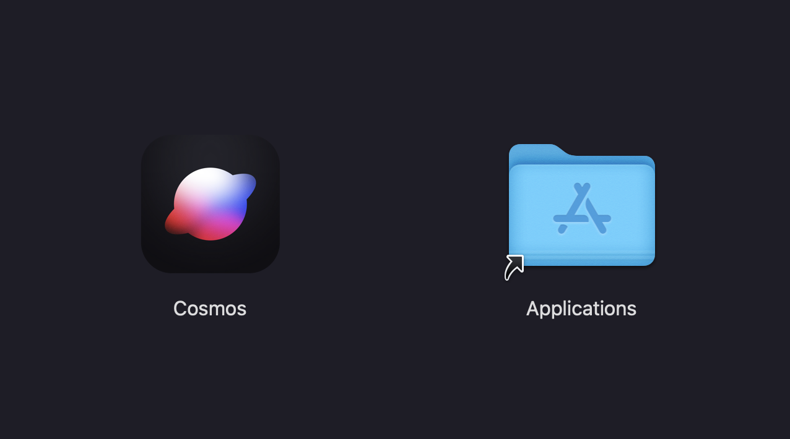

# Cosmos

A local-first bookmark app for macOS. Collect images, links, and text notes in a visual masonry grid — all stored as plain files in a folder you choose.

Built with Tauri 2 + React + TypeScript.


## Features

- **Vault-based storage** — Obsidian-style plain files in a user-chosen folder. No database, no cloud lock-in.
- **Image import** — Drag-and-drop or file picker. Copies to vault, extracts dimensions and dominant color.
- **Link import** — Paste a URL, fetches OG metadata and preview thumbnail automatically.
- **Text notes** — Markdown notes stored as `.md` files.
- **Video import** — Import video files with in-app playback.
- **Masonry grid** — CSS columns layout with responsive column count.
- **Tags** — Add/remove tags on any item, filter by tag.
- **Collections** — Organize items into named collections with color coding.
- **Search** — Client-side search across titles, tags, URLs, and descriptions.
- **AI auto-tagging** — Optional OpenAI-powered tag suggestions and descriptions on import.
- **Frameless window** — Native macOS traffic lights integrated into the toolbar.
- **MCP server** — Claude Desktop integration for managing your vault via natural language.

## Tech Stack

| Layer         | Choice                                            |
| ------------- | ------------------------------------------------- |
| Shell         | Tauri 2.0 (WKWebView, ~5MB binary)                |
| Frontend      | React 19 + TypeScript + Vite                      |
| Styling       | Tailwind CSS 4                                    |
| State         | Zustand                                           |
| Backend       | Rust (`#[tauri::command]`)                        |
| Link previews | `reqwest` + `scraper` (Rust-side OG tag fetching) |
| AI            | OpenAI GPT-4o (optional)                          |

## Vault Structure

```
~/MyVault/
├── .cosmos/
│   ├── index.json          # Metadata index for all items
│   └── assets/             # Images, videos, link thumbnails
│       ├── a1b2c3d4.jpg
│       └── e5f6g7h8-preview.jpg
└── notes/                  # Text notes as markdown
    └── m3n4o5p6.md
```

## Getting Started

### Prerequisites

- [Node.js](https://nodejs.org/) (v18+)
- [Rust](https://rustup.rs/)
- [Tauri CLI](https://v2.tauri.app/start/prerequisites/)

### Setup

```bash
# Install dependencies
npm install

# Create a .env file with your OpenAI API key (optional, for AI tagging)
echo "OPENAI_API_KEY=your-key-here" > .env

# Run in development
npm run tauri dev

# Build for production
npm run tauri build
```

The built app will be at `src-tauri/target/release/bundle/macos/Cosmos.app`. Open the generated `.dmg` and drag Cosmos into Applications.



### MCP Server (Claude Desktop)

The `mcp-server/` directory contains an MCP server for Claude Desktop integration.

```bash
cd mcp-server
npm install
npm run build
```

Add to your Claude Desktop config (`~/Library/Application Support/Claude/claude_desktop_config.json`):

```json
{
  "mcpServers": {
    "cosmos": {
      "command": "node",
      "args": ["/path/to/cosmos/mcp-server/dist/index.js"],
      "env": {
        "COSMOS_VAULT": "/path/to/your/vault"
      }
    }
  }
}
```

## License

MIT
